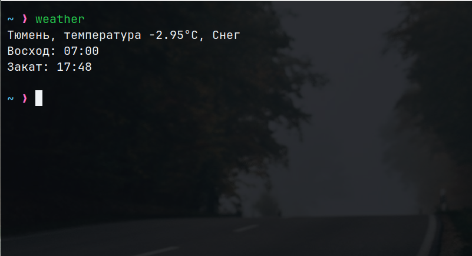

Програмка выводит погодные условия в терминале по текущим GPS координатам. Чтобы получить координаты один из модулей программы обращается к сервису `ipinfo.io`.

Получаем мы погоду, обращаясь к апишке сервиса OpenWeather.

Для запуска программы необходимо в config.py проставить свой API ключ для доступа к OpenWeather. 

Запускается с помощью команды `./weather`.

